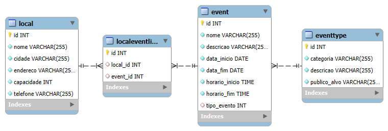

# API RESTful para gerenciar de eventos

**Autores:** [Lucas Lima](https://github.com/lucasouzamil) e [Luiz Pini](https://github.com/luizehp)

[Vídeo de apresentação](https://youtu.be/6ifbAGSa7CA)

## Introdução

Este projeto é uma API RESTful integrada a banco de dados e construída em FastAPI, reponsável pelo gerenciamento de eventos. A API contém rotas CRUD para as 4 tabelas abaixo.



## Requisitos

- Python 3.8+
- Banco de dados de preferencia (PostgreSQL, MySQL, SQLite, Oracle, Microsoft SQL Server, MariaDB, Firebird, Sybase, Drizzle, Amazon Redshift)

## Instalação e Configuração

Na raiz do projeto siga os seguintes passos:

### 1. Criar um ambiente virtual (se não tiver criado ainda)

#### Windows:

```bash
python -m venv .venv
```

#### MacOS/Linux:

```bash
python3 -m venv .venv
```

### 2. Ativar o ambiente virtual

#### Windows:

```bash
.venv\Scripts\activate
```

#### MacOS/Linux:

```bash
source .venv/bin/activate
```

### 3. Instalar dependências:

```bash
pip install -r requirements.txt
```

### 4. Criar um .env

1. Na raiz do projeto, crie um arquivo chamado .env.
2. Copie o conteúdo do arquivo .env.example para o novo arquivo .env.
3. Preencha as informações necessárias, como mostrado abaixo, de acordo com a configuração do seu banco de dados:

```bash
USER=
SECRET_KEY=
SERVER=
```

* USER: Coloque o nome de usuário do seu banco de dados.
* SECRET_KEY: Adicione uma chave secreta que será usada pela aplicação.
* SERVER: Defina o endereço do servidor do banco de dados.

### 5. Configurar link com banco de dados

Caso você não esteja usando o MYSQL, atualize os links nas linhas 24 e 25 do arquivo main.py para o do seu respectivo banco de dados.

### 6. Executar a API:

**OBS**: não esqueça de ativar o ambiente virtual sempre que for colocar a aplicação no ar.

```bash
fastapi dev main.py
```

Acesse a API em [http://127.0.0.1:8000](http://127.0.0.1:8000)

### 7. Documentação da API:

- **Swagger UI**: [http://127.0.0.1:8000/docs](http://127.0.0.1:8000/docs)
- **ReDoc**: [http://127.0.0.1:8000/redoc](http://127.0.0.1:8000/redoc)
